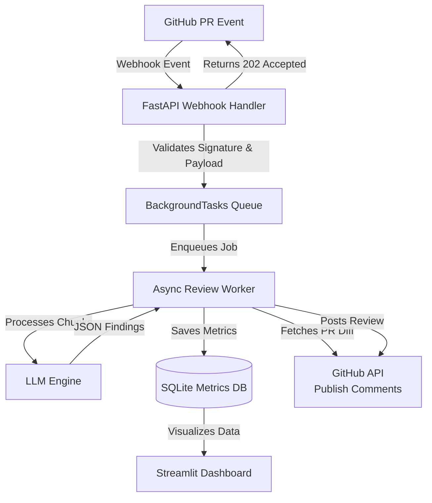
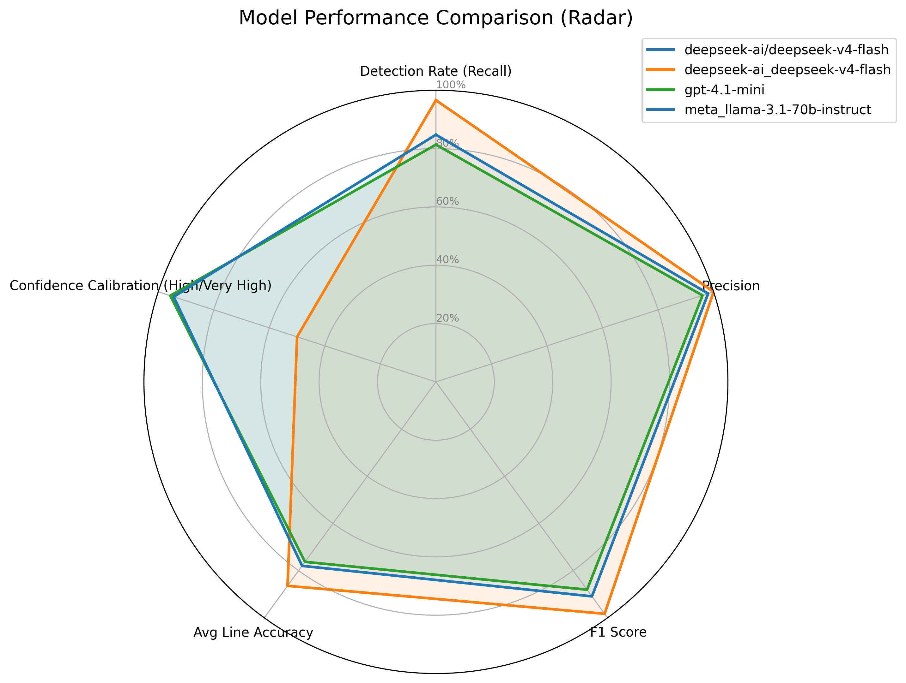
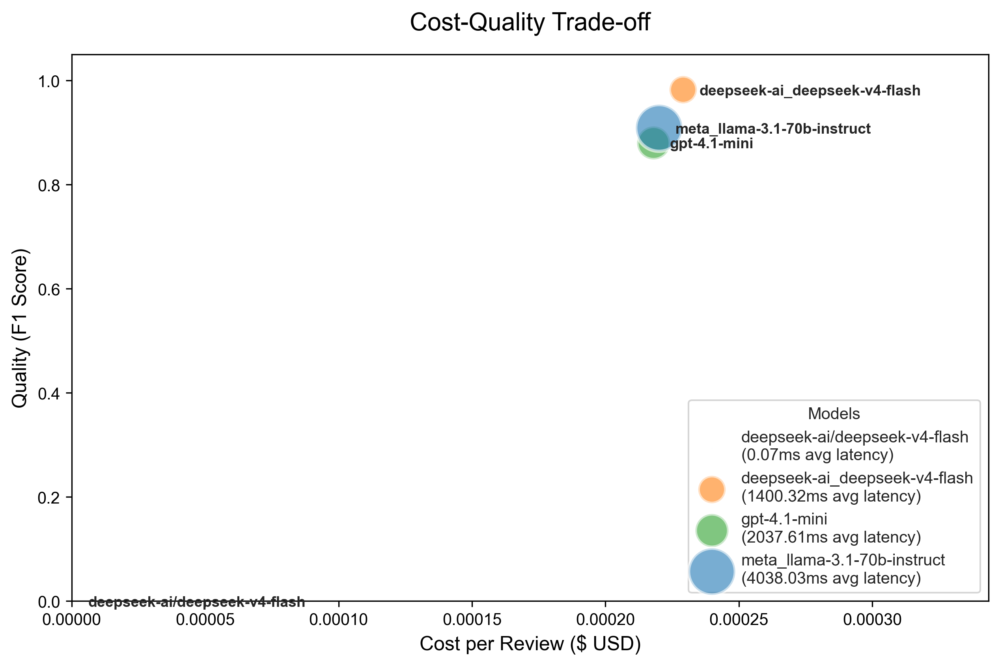

# AI Code Review Assistant

An automated, AI-powered GitHub App that automatically reviews pull requests, generates inline code review comments, and posts structured security and maintainability findings. This project combines a production-ready asynchronous backend with a rigorous AI evaluation framework to benchmark LLM capabilities on security vulnerabilities.

---

## 🌟 Project Overview

This project serves a dual purpose:
1. **Production Code Review Tool**: A fast, asynchronous webhook receiver that hooks into GitHub PRs and automatically posts actionable, context-aware comments on changed code.
2. **AI Research & Evaluation Framework**: A comprehensive benchmarking suite containing 84 security-focused evaluation cases designed to test precision, recall, F1-score, cost, and latency across multiple LLMs (DeepSeek V4 Flash, GPT-4o-mini, Llama 3.1).

---

## 🏗️ Architecture

### End-to-End Workflow

1. **GitHub PR Creation**: A user opens or synchronizes a pull request.
2. **Webhook Trigger**: GitHub sends an HTTP POST webhook containing the event payload to the FastAPI server.
3. **Validation & Acceptance**: FastAPI validates the HMAC signature, queues the processing task into `BackgroundTasks`, and returns a `202 Accepted` response within milliseconds to prevent GitHub timeouts.
4. **AI Review**: The background worker fetches the PR diff, maps file chunks, and queries the LLM engine for summary and inline reviews.
5. **Publishing**: The LLM JSON responses are structured and published directly as review comments back on the GitHub PR.
6. **Observability**: Execution duration, token usage, and findings are logged to an embedded SQLite database.
7. **Dashboarding**: A Streamlit dashboard visualizes the stored metrics, operational status, and evaluation results.

---

## ✨ Features

- **Asynchronous Webhooks**: Non-blocking `FastAPI BackgroundTasks` architecture eliminates timeout risks and prevents thread starvation.
- **Diff Parsing & Line Mapping**: Intelligently chunks PR diffs and accurately maps LLM feedback to GitHub line numbers.
- **Structured JSON Reviews**: Enforces strict `json_object` schemas from the LLM for highly reliable parsing and inline comment placement.
- **Security & Maintainability Focus**: Analyzes PRs specifically for critical security vulnerabilities and architectural maintainability.
- **Metrics Dashboard**: A live Streamlit dashboard tracks token usage, cost, finding distributions, and API latency.
- **Evaluation Framework**: A fully built-in pipeline to benchmark LLM detection rates across 84 real-world safe and vulnerable code snippets.

---

## 🛠️ Tech Stack

- **Backend**: FastAPI, Uvicorn, Python 3.11+
- **AI Integration**: OpenAI Python SDK (compatible with GPT-4, Llama 3, DeepSeek)
- **Database**: SQLite (local persistence)
- **Dashboard**: Streamlit, Plotly, Pandas
- **Integrations**: GitHub Apps API, PyGithub
- **Testing**: Pytest, Asyncio

---

## 🔬 Evaluation Framework

To rigorously test the AI's capability to detect security flaws, a benchmarking framework was developed with **84 evaluation cases (59 vulnerable, 25 safe)** spanning categories like SQL Injection, SSRF, XSS, and Path Traversal. 

> [!NOTE]
> The benchmark results shown below were generated using **simulated model performance profiles** to validate the evaluation and visualization pipeline during development while provider endpoints experienced severe latency/timeout issues.

### Multi-Model Comparison (Radar)

### Cost vs Quality Trade-off

---

## 📸 Screenshots

*The following screenshots demonstrate the UI integrations and the dashboard functionality.*

### GitHub PR Summary

### GitHub Inline Comments

### Analytics Dashboard

---

## 🎥 Demo Video

[Watch the 3-minute End-to-End Walkthrough Here](assets/demo-video-link.txt)

---

## 🔒 Security Posture

- **HMAC Signature Validation**: All incoming webhooks are strictly verified using `X-Hub-Signature-256`.
- **Payload Verification**: Pydantic models enforce strict schema validation to prevent injection or malformed data processing.
- **Credential Isolation**: GitHub Private Keys and LLM API Keys are isolated via environment variables (`.env`) and explicitly excluded from git history using `.gitignore` and `git filter-repo`.

---

## 🚀 Future Improvements

- **Intelligent Routing**: Route complex PRs to frontier models (e.g., GPT-4) and simple typo-fixes to fast models (e.g., Llama 3 8B) dynamically.
- **Fine-Tuned Evaluators**: Fine-tune a smaller open-source model specifically on the generated evaluation datasets for lower latency and cost.
- **Expanded Context**: Add RAG (Retrieval-Augmented Generation) to allow the LLM to search the broader repository codebase before commenting on isolated diff chunks.
