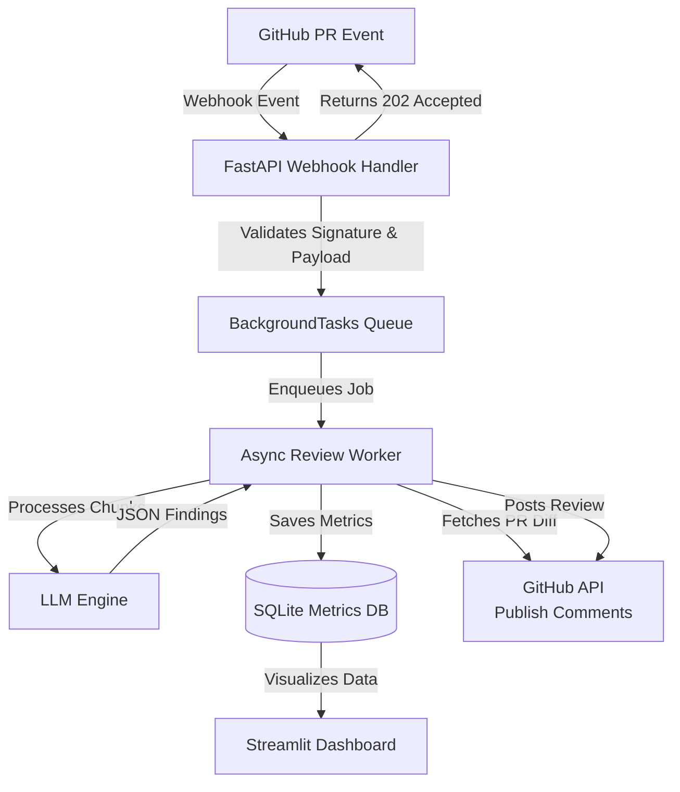

# AI Code Review Assistant

[](https://www.python.org/downloads/release/python-3110/)
[](https://fastapi.tiangolo.com)
[](https://streamlit.io/)
[](https://docs.github.com/en/apps)

An automated, AI-powered GitHub App that automatically reviews pull requests, generates inline code review comments, and posts structured security and maintainability findings. This project combines a production-ready asynchronous backend with a rigorous AI evaluation framework to benchmark LLM capabilities on security vulnerabilities.

---

## 🌟 Project Overview

This project serves a dual purpose:
1. **Production Code Review Tool**: A fast, asynchronous webhook receiver that hooks into GitHub PRs and automatically posts actionable, context-aware comments on changed code.
2. **AI Research & Evaluation Framework**: A comprehensive benchmarking suite containing 84 security-focused evaluation cases designed to test precision, recall, F1-score, cost, and latency across multiple LLMs (DeepSeek V4 Flash, GPT-4o-mini, Llama 3.1).

---

## 🏗️ Architecture

The application is built around a non-blocking `FastAPI BackgroundTasks` architecture that intercepts pull requests, parses diffs, evaluates them via LLMs, and publishes both summary and inline comments. Execution metrics are stored locally in SQLite and surfaced via a Streamlit Dashboard.



### End-to-End Workflow

1. **GitHub PR Creation**: A user opens or synchronizes a pull request.
2. **Webhook Trigger**: GitHub sends an HTTP POST webhook containing the event payload to the FastAPI server.
3. **Validation & Acceptance**: FastAPI validates the HMAC signature, queues the processing task, and returns a `202 Accepted` response.
4. **AI Review**: The background worker fetches the PR diff, filters noisy files, maps file chunks, and queries the LLM engine for summary and inline reviews.
5. **Publishing**: The LLM JSON responses are structured, filtered by confidence, and published directly as review comments back on the GitHub PR.
6. **Observability & Dashboarding**: Execution duration, token usage, and findings are logged to an embedded SQLite database and visualized on a live Streamlit dashboard.

---

## ✨ Features

- **Asynchronous Webhooks**: Non-blocking architecture eliminates timeout risks and prevents thread starvation.
- **Diff Parsing & Line Mapping**: Intelligently chunks PR diffs and accurately maps LLM feedback to precise GitHub line numbers.
- **Structured JSON Reviews**: Enforces strict `json_object` schemas from the LLM for highly reliable parsing and inline comment placement.
- **Security & Maintainability Focus**: Analyzes PRs specifically for critical security vulnerabilities (e.g., SQLi, XSS, SSRF, Path Traversal) and architectural maintainability.
- **Metrics Dashboard**: A live Streamlit dashboard tracks token usage, cost, finding distributions, and API latency.
- **Evaluation Framework**: A fully built-in pipeline to benchmark LLM detection rates across 84 real-world safe and vulnerable code snippets.

---

## 🛠️ Tech Stack

- **Backend**: FastAPI, Uvicorn, Python 3.11+
- **AI Integration**: OpenAI Python SDK (compatible with GPT-4, Llama 3, DeepSeek)
- **Database**: SQLite (local persistence)
- **Dashboard**: Streamlit, Plotly, Pandas
- **Integrations**: GitHub Apps API, PyGithub
- **Testing**: Pytest, Asyncio

---

## 🚀 Setup & Installation

### 1. Local Development Setup

```bash
# Clone the repository
git clone https://github.com/aarush23g/AI-Code-Review-Assistant-Github.git
cd AI-Code-Review-Assistant-Github

# Create and activate virtual environment
python -m venv .venv
# On Windows:
.venv\Scripts\Activate.ps1
# On Linux/macOS:
source .venv/bin/activate

# Install dependencies
pip install -r requirements.txt
pip install -r requirements-dev.txt
```

### 2. Configuration

Copy the example environment file and populate your credentials:

```bash
cp .env.example .env
```

**Model Configuration (Current Recommendation):**
We currently recommend `deepseek-ai/deepseek-v4-flash` via NVIDIA NIM due to its high cost-effectiveness, low latency, and competitive baseline performance.

```env
OPENAI_API_KEY=nvapi-<your-key>
OPENAI_BASE_URL=https://integrate.api.nvidia.com/v1
OPENAI_MODEL=deepseek-ai/deepseek-v4-flash
```

The system supports any OpenAI-compatible endpoint. To switch to GPT-4o-mini, simply update `OPENAI_MODEL` and `OPENAI_BASE_URL`.

### 3. Verify Setup

Run the test suite:
```bash
pytest tests/ -v
```

### 4. Running the Application

To start the FastAPI webhook server:
```bash
python -m uvicorn app.main:app --reload --host 0.0.0.0 --port 8000
```
*(Or use the provided PowerShell script: `.\scripts\run_dev.ps1`)*

To start the metrics dashboard:
```bash
streamlit run dashboard/dashboard_app.py
```

### 5. GitHub App Configuration

To use this bot on your own repositories, you need to create a GitHub App:
1. Go to your GitHub Developer Settings and create a new GitHub App.
2. Grant **Read & Write** permissions for **Pull Requests** and **Issues**.
3. Subscribe to the **Pull Request** webhook events (`opened`, `synchronize`, `reopened`).
4. Generate a private key, download the `.pem` file, and place it in the project root.
5. Update your `.env` with the App ID, Webhook Secret, and Private Key Path.

---

## 🔬 Evaluation Framework

To rigorously test the AI's capability to detect security flaws, a benchmarking framework was developed containing **84 evaluation cases** (59 vulnerable, 25 safe) spanning 13 security categories such as SQL Injection, SSRF, XSS, Hardcoded Secrets, and Path Traversal.

The framework computes a weighted composite score prioritizing **Recall** over Precision, as missing vulnerabilities (false negatives) is far more dangerous than false alarms in a security-focused context.

### Running Benchmarks
```bash
# Run evaluation for the current model
python -m evaluation.evaluate --mode security --rate-limit 2.0

# Compute metrics and generate reports
python -m evaluation.metrics evaluation/results/run_<timestamp>.json
```

### Multi-Model Comparison (Radar)


### Cost vs Quality Trade-off


---

## 🤝 Contributing

We enforce a consistent code style across the project. Before submitting a Pull Request, please ensure you run the following:

```bash
# Format code
black .
# Linting
ruff check .
# Type checking
mypy app/
# Run test suite
pytest tests/ -v
```

---

## 🔒 Security Posture

- **HMAC Signature Validation**: All incoming webhooks are strictly verified using `X-Hub-Signature-256`.
- **Payload Verification**: Pydantic models enforce strict schema validation to prevent injection or malformed data processing.
- **Credential Isolation**: GitHub Private Keys and LLM API Keys are isolated via environment variables (`.env`) and explicitly excluded from git history.

---

## 🚀 Future Improvements

- **Intelligent Routing**: Route complex PRs to frontier models (e.g., GPT-4) and simple typo-fixes to fast models (e.g., Llama 3 8B) dynamically.
- **Fine-Tuned Evaluators**: Fine-tune a smaller open-source model specifically on the generated evaluation datasets for lower latency and cost.
- **Expanded Context**: Add RAG (Retrieval-Augmented Generation) to allow the LLM to search the broader repository codebase before commenting on isolated diff chunks.

---

## 👤 Author

Developed by Aarush. Check out the project roadmap or open an issue to get involved!
