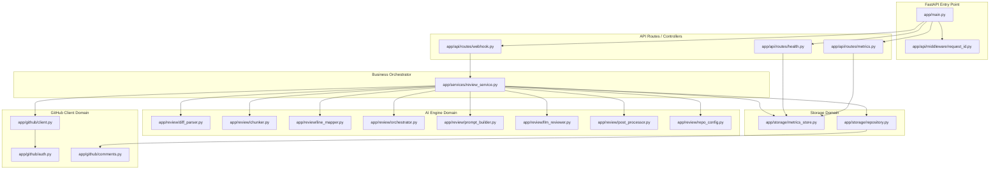

# AI Code Review Assistant - System Architecture Analysis

This document details the architectural design, file layout, and component relationships of the AI Code Review Assistant.

---

## 1. Directory Structure & Repository Map

The repository is structured logically, separating backend web endpoints, LLM engine processing, developer operations (dashboard), testing, and benchmarking.

```
ai-code-review-assistant/
├── .github/
│   └── workflows/
│       └── ci.yml              # GitHub Actions configuration (pytest, ruff, black)
├── app/                        # Main FastAPI application
│   ├── api/                    # API Routing and Middleware layers
│   │   ├── middleware/
│   │   │   └── request_id.py   # Request ID generation & context propagation
│   │   └── routes/
│   │       ├── health.py       # Health check with DB and LLM check probes
│   │       ├── metrics.py      # Summary metrics endpoint for client consumption
│   │       └── webhook.py      # GitHub webhook receiver, signature verify & controller
│   ├── core/                   # Global settings, logging, and security helpers
│   │   ├── config.py           # Pydantic Settings base (.env file configuration loader)
│   │   ├── logging.py          # Structured/JSON logging and ContextVar request mapping
│   │   └── security.py         # Webhook signature verification (HMAC SHA-256)
│   ├── github/                 # GitHub REST API integrations
│   │   ├── auth.py             # JWT generation using RS256 private PEM keys
│   │   ├── client.py           # Persistent httpx.AsyncClient & cached installation tokens
│   │   └── comments.py         # Bot markers and comment formatting templates
│   ├── review/                 # Core AI evaluation engine
│   │   ├── chunker.py          # Splits long git patches into token-safe limits
│   │   ├── diff_parser.py      # Skips lockfiles, binary files, and custom ignore paths
│   │   ├── line_mapper.py      # Maps lines changed to prevent commenting outside changes
│   │   ├── llm_reviewer.py     # OpenAI AsyncClient integrations with tenacity retries
│   │   ├── orchestrator.py     # Strategy selector (skip, summary-only, full review)
│   │   ├── post_processor.py   # Deduplicator, confidence filter, and top-findings selector
│   │   ├── prompt_builder.py   # System and User prompt formatters (JSON templates)
│   │   ├── repo_config.py      # Parses .aireview.yml repo-level settings
│   │   └── rules.py            # Static lists of binary file extensions & ignored folder names
│   ├── schemas/                # Pydantic validation models
│   │   ├── github.py           # Git PR details and PR file definitions
│   │   ├── repo_config.py      # .aireview.yml validation schema
│   │   ├── review.py           # Internal review results schemas (TopIssue, findings)
│   │   └── webhook.py          # GitHub Webhook payload schema
│   ├── services/               # Core business orchestration layer
│   │   └── review_service.py   # Orchestrator binding GitHub, LLM, and SQLite Metrics
│   └── storage/                # SQLite data layer
│       ├── metrics_store.py    # aiosqlite interface for storing review histories
│       └── repository.py       # Utility queries for locating past bot review comments
├── dashboard/
│   └── app.py                  # Streamlit monitoring dashboard UI
├── evaluation/                 # Accuracy benchmarking engine
│   ├── dataset/                # OWASP and CWE benchmark suites
│   │   ├── safe_snippets.json  # 25 safe code snippets (for false-positive calculations)
│   │   └── vulnerable_snippets.json # 59 vulnerable snippets
│   ├── evaluate.py             # Evaluation test harness runner (concurrent LLM requests)
│   └── metrics.py              # Evaluator metrics calculator (Precision, Recall, F1)
├── notebooks/                  # Interactive evaluation analysis notebooks
└── tests/                      # Pytest automation suite (56 tests)
```

---

## 2. Core Components and File Relationships



### Component Analysis:

1. **FastAPI & API Handlers (`app/main.py`, `app/api/routes/webhook.py`)**:
   - `main.py` registers middleware and routes. It sets up a FastAPI lifespan handler that instantiates `GitHubAPIClient` and `ReviewService` as singletons, passing them into `app.state.review_service` to avoid instantiating new HTTP clients on every incoming request.
   - `webhook.py` validates the signature of incoming webhooks using HMAC-SHA256, verifies the payload model, checks if the action is supported (opened, reopened, sync), and hands execution to the `ReviewService`.

2. **Orchestrator Service (`app/services/review_service.py`)**:
   - Acts as the central mediator. It fetches PR metadata, requests changed files, checks for a repository-level review config (`.aireview.yml`), filters files, structures them into chunks, determines whether to do a full review, limited review, or skip, and runs LLM requests. It then writes execution results to SQLite.

3. **GitHub Client (`app/github/client.py`)**:
   - Utilizes `httpx.AsyncClient` for persistent connections. It implements custom authentication as a GitHub App by signing JWTs using a private RS256 key (`auth.py`). It caches installation access tokens with a safety margin refresh of 60 seconds.

4. **Review Chunker & Parser (`app/review/chunker.py`, `app/review/diff_parser.py`)**:
   - Skips files matching static rules (binaries, lockfiles, package trees) and custom `.aireview.yml` paths.
   - Splits long diff patches into token-safe chunks (max 3000 characters by default) so they fit comfortably within LLM context windows and don't trigger context limits.

5. **Line Mapper (`app/review/line_mapper.py`)**:
   - Parses unified git diff headers (`@@ -old +new @@`) and keeps track of which target-side lines are actually added or modified in the PR. This is crucial for validation: it guarantees that inline review comments are only posted on lines modified by the user.

6. **LLM Reviewer & Prompts (`app/review/llm_reviewer.py`, `app/review/prompt_builder.py`)**:
   - `llm_reviewer.py` handles ChatCompletion requests via Pydantic model validation. It implements `tenacity` retries (up to 3 attempts with exponential backoff) and automatically triggers a JSON structure recovery prompt if the model returns malformed JSON.
   - `prompt_builder.py` provides clean structures for the prompts, including specific instruction overrides for "security" and "maintainability" review modes.

7. **Database Storage (`app/storage/metrics_store.py`)**:
   - Implements async operations to store operational metrics (token count, cost, latency, file counts, issue counts) in an SQLite database using `aiosqlite`.

---

## 3. Data Flow Architecture

The data flows through the application via three primary pipelines:

### Webhook Event Flow
- GitHub sends a pull request webhook.
- FastAPI checks `X-Hub-Signature-256` header against the payload using `hmac` compare digest.
- Payload parsed into `PullRequestWebhookPayload`.
- `ReviewService` runs the asynchronous pipeline and posts comments back to GitHub API.
- Execution metrics are persisted in the SQLite DB.
- Webhook route returns `200 OK` (with review summary) to GitHub.

### Metric Monitoring Flow
- Streamlit application reads metrics from the SQLite database.
- Streamlit renders KPI cards, line charts of total reviews, and bar charts of token distribution/costs.
- Streamlit queries the `evaluation/results` folder to populate the Model Performance evaluation tables.

### Benchmark Evaluation Flow
- `evaluate.py` loads snippets from `evaluation/dataset/vulnerable_snippets.json` and `safe_snippets.json`.
- For each snippet, a fake PR context is generated.
- The snippet is reviewed using concurrent async calls (`generate_pr_summary_review` and `generate_inline_findings`).
- `metrics.py` parses the output JSON, matches findings against ground-truth vulnerable lines, and computes precision, recall, and F1.
- Metrics are written back to a markdown report and results JSON file.
