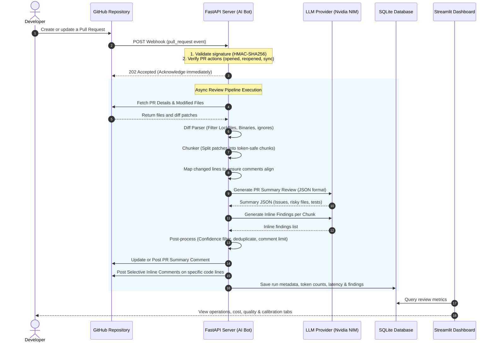

# AI Code Review Assistant - Project Summary

## What This Project Does
The **AI Code Review Assistant** is an automated code review bot designed as a GitHub App. It intercepts GitHub Pull Request webhooks, retrieves the modified code diff patches, parses them into manageable chunks, and runs them through a Large Language Model (LLM) review engine (currently utilizing `deepseek-ai/deepseek-v4-flash` via NVIDIA NIM). 

The assistant provides two layers of feedback back to GitHub:
1. **Summary Comments**: High-level review summaries, identified top issues (categorized by severity and confidence), list of risky files, and testing suggestions.
2. **Inline Comments**: Selective, high-confidence comments posted directly on the specific lines of the pull request changes where bugs, security vulnerabilities, or maintainability issues were detected.

Additionally, the project features:
- An **Evaluation Benchmark Framework** consisting of 84 python snippets (59 vulnerable + 25 safe) across 13 security categories to assess LLM precision, recall, and false-positive rates.
- A **Streamlit Metrics Dashboard** to monitor bot operations, token usage, cost tracking, quality stats, and benchmarking performance.

---

## Intended Users & Value Proposition
- **Engineering Teams & Tech Leads**: Reduces code review latency by catching trivial issues (security leaks, input validation gaps, code duplication, weak cryptography) automatically, allowing human reviewers to focus on architectural decisions and business logic.
- **QA & Security Leads**: Standardizes security review rules (OWASP Top 10, CWE) across all PRs.
- **DevOps/SRE**: Monitors operational cost, latency, and LLM provider token consumption trends.

---

## Core Workflow & End-to-End User Journey

---

## Executive Summary & Completion Status
The AI Code Review Assistant is a well-designed, highly typed, and structurally sound repository. All core engineering aspects—including robust models, retry policies, structured outputs, security HMAC checking, database storage, and a monitoring frontend—have been implemented. 

However, **the application is not yet production-ready** due to several critical operational bugs, configuration errors, security risks (hardcoded secrets and PEM key in git history), and a major execution bottleneck (webhooks block execution synchronously instead of running in the background).

### Current Completion Percentage: **81.5%**

* **Backend API (70%)**: Structurally complete but blocks webhook responses during long-running AI tasks. Lack of runtime asynchronous background workers is a major scalability bottleneck.
* **AI Engine & Prompts (90%)**: Fully typed prompts and post-processors with tenacity retries, JSON validation recovery, confidence thresholds, and line verification mapping.
* **GitHub Integration (85%)**: Correct OAuth client token caching, comment updates, and HMAC signature checks. Typos in configuration paths prevent immediate execution.
* **Frontend Dashboard (80%)**: Full Streamlit app completed with rich visualization but broken by default due to a database file naming discrepancy.
* **Infrastructure & CI/CD (95%)**: Non-root multi-stage Docker build, `.dockerignore` filters, and working GitHub Actions workflows.
* **Testing (95%)**: 56 unit and integration tests written and passing successfully with extensive mock fixtures.

---

## High-Level Project Evaluation

### Strengths
1. **Strong Typings and Schema Validation**: Pydantic is used consistently for incoming webhooks, GitHub API responses, LLM outputs, configuration, and database models.
2. **LLM Resilience**: Integrated tenacity decorators, strict JSON recovery prompt fallback, and max token limits prevent LLM timeouts and parsing failures.
3. **High Signal Post-processing**: Line mapping logic ensures inline comments are *only* posted on lines actually modified/added in the PR. Deduplication and severity sorting ensure high quality.
4. **Comprehensive Test Suite**: The 56 tests cover every file parser, post-processor, and routing handler.

### Key Gaps & Failures
1. **Synchronous Webhook Handling**: Webhook requests wait for two sequential LLM calls and multiple GitHub API calls before returning, which can cause connection timeouts on GitHub's end.
2. **Configuration Typo**: The `.env` template contains a typo in the private key name (`codesaver-ai.2026-054-04.private-key.pem` vs `codesaver-ai.2026-05-04.private-key.pem`), breaking token generation.
3. **Database File Naming Discrepancy**: Streamlit queries `review_metrics.db` but the backend writes to `review_metrics.sqlite3`.
4. **Exposed Credentials**: A live private key PEM file is checked into the repository root, alongside client secrets in env configuration files.
5. **Errored Benchmark Data**: The pre-recorded benchmark evaluation run in the repository contains syntax errors for all 84 snippets, recording 0.0% precision and recall.
